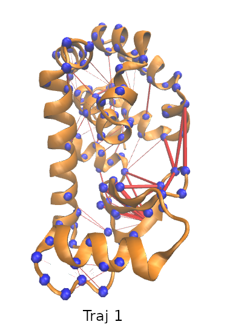

# RF-TICA-MD
This repository contains the codes and scripts for the paper "Resolving Protein Conformational Plasticity and Substrate Binding Through the Lens of Machine-Learning" by Navjeet Ahalawat and Jagannath Mondal (2022) doi: https://doi.org/10.1101/2022.01.07.475334

I am using Anaconda (Python 3.6) and the following packages:
- MSMBuilder 3.8.0.
- PyEMMA 2.5.4
- scikit-learn 0.19.2
- numpy
- matplotlib

## Files
- ```run_pair_distances.sh``` - bash script to calculate distances between given pairs using msmbuilder package
- ```contact_pairs.txt``` - contact pairs used in in msmbuilder 
- ```script_randomforest.py``` - python script to build the Random Forest Classifier Model
- ```xgboost.py``` - python script to build XGBoost model for classification 
- ```selected_pairs2npy.py``` - Python script to extract the selected pairs identified from RF Classifier
- ```Top200_residue_pairs``` - Top 200 pairs from the RF Classifier Model of T4L system
- ```plot_tica.py``` - Python script to plot the free energy surface
- ```plot_tica_fig2.py``` - Python script to plot the free energy surface
- ```plot_tica_fig2_new.py``` - Python script to plot the free energy surface
- ```plot_tica_fig4.py``` - Python script to plot the free energy surface
- ```plot_tica_fig4_new.py``` - Python script to plot the free energy surface
- ```traj1_pairs_1-2.tcl``` - VMD TCL script to visulaize network of the selected pairs
- ```traj2_pairs_1-2.tcl``` - VMD TCL script to visulaize network of the selected pairs
- ```traj3_pairs_1-2.tcl``` - VMD TCL script to visulaize network of the selected pairs
- ```t4l_image.com``` - UCSF Chimera script to visulaize the T4L protein

### preparing data and adapting script
1. Prepare raw collective varibale using msmbuilder script.
2. Catenate all the numpy files and rename it to X_3_trajs.npy
3. Calculate distance between cavity COM and ligand (benzene) COM
4. Catenate all distance files in the same order of X_3_trajs.npy and convert it into binary format 0 and 1 using distance cutoff criteria. Rename this file as Y_3_trajs.npy.
5. Build RF Classifier Model using script_randomforrest.py
6. Use this model for further analysis

### Generating Network Images using vmd, ref.pdb, and tcl scripts
```
$ vmd -e traj1_pairs_1-2.tcl ref.pdb

```


```
$ vmd -e traj2_pairs_1-2.tcl ref.pdb

```


```
$ vmd -e traj3_pairs_1-2.tcl ref.pdb

```

